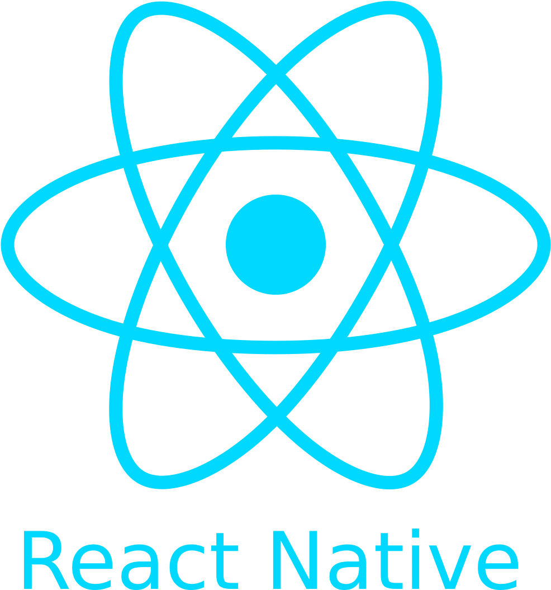

<h1 id="react-native-todolist">react-native-todolist</h1>

The react-native-todolist application is a cross-platform mobile application developed using the React-Native framework with Redux implementation. The application has features to create a calendar in both Google &amp; Microsoft cloud platforms, users can also receive a push notification from the server based on topic subscription.

<table>
  <tr>
    <td></td>
    <td></td>
  </tr>
</table>

<h1 id="features-">Features!</h1>
<ul>
<li>Social SignIn with Google, Microsoft, Facebook.</li>
<li>Google &amp; Microsoft Calendar integration that user can create new events.</li>
<li>Upload attachements with Google Drive and One Drive. </li>
<li>Share events to social apps.</li>
<li>Receive push-notification from server based on topic subscription.</li>
</ul>
<h1 id="installing-dependencies">Installing dependencies</h1>

 There are few environment setups required to install the dependencies for the development of a cross-platform application using React-Native.

<h5 id="react-native-cli-setup">React-Native Cli Setup</h5>
<ul>
<li>Download and Install Node.js<ul>
<li>Windows &amp; macOS - <a href="https://nodejs.org/en/download/">https://nodejs.org/en/download/</a></li>
<li>Linux - <code>sudo apt install nodejs npm</code></li>
</ul>
</li>
<li>React-Native Cli can install using npm command
  <code>npm install -g react-native-cli</code></li>
</ul>
<h5 id="android-installation-dependencies">Android Installation dependencies</h5>
<ul>
<li>The Android development setup requires Android Studio and JDK (Java Development Kit).</li>
<li><h6 id="java-development-kit-https-www-oracle-com-java-technologies-javase-jdk8-downloads-html">Java Development Kit : <a href="https://www.oracle.com/java/technologies/javase-jdk8-downloads.html">https://www.oracle.com/java/technologies/javase-jdk8-downloads.html</a></h6>
</li>
<li><h6 id="install-android-studio-">Install Android Studio :</h6>

  Download and Install Android Studio with the following link which can be used to install across all operating systems (Windows, Linux &amp; macOS).
<a href="https://developer.android.com/studio/index.html">https://developer.android.com/studio/index.html</a>

</li>
<li>Configure <code>ANDROID_HOME</code> environmental variable<h6 id="windows-">Windows -</h6>
<ul>
<li>Right Click on <code>My Computer</code> .</li>
<li>Click on <code>Properties</code> then in the left panel Choose <code>Advanced system settings</code>.</li>
<li>In the dialog box Click on <code>Environment Variables</code> .</li>
<li>After that in the user variable click on <code>New</code> and create a new <code>ANDROID_HOME</code> variable and the value will the local installation path of Android SDK<h6 id="linux-mac-os-">Linux &amp; Mac OS -</h6>
</li>
<li><h6 id="open-the-terminal-and-type">Open the terminal and type</h6>
  <code>$nano ~/.bash_profile</code>
  <code>$ export ANDROID_HOME=/YOUR_PATH_TO/android-sdk</code>
  <code>$ export PATH=$ANDROID_HOME/platform-tools:$PATH</code>
  <code>$source ~/.bash_profile</code> </li>
</ul>
</li>
</ul>
<h5 id="ios-installation-dependencies">iOS Installation dependencies</h5>
<ul>
<li>The iOS installation depends on Xcode that can be installed via the mac AppStore.</li>
<li>
The latest version of <code>Xcode 9.4</code> or the latest has to be installed in the system

<h5 id="xcode-command-line-tools">Xcode Command Line Tools</h5>

  There are a few Xcode command-line tools that need to be installed.

<ul>
<li>Open <code>Xcode</code> , then choose <code>Preference</code> from the Xcode menu.</li>
<li>
Go to the <code>Location</code> panel and install the tools by selecting from the most recent version of the command-line tool from the dropdown.

<h5 id="installing-ios-simulator-in-xcode">Installing iOS simulator in Xcode</h5>

Open <code>Xcode</code> -&gt; Preference and then select a simulator that will be compatible with the installed <code>iOS</code> version.

<h5 id="cocoapods">CocoaPods</h5>

This is a dependency manager that will install the required libraries for iOS development. The CocoaPods application is written in Ruby.

<code>sudo gem install cocoapods</code>

For more information on CocoaPods Guide -
<a href="https://guides.cocoapods.org/using/getting-started.html">https://guides.cocoapods.org/using/getting-started.html</a>

</li>
</ul>
</li>
</ul>
<h4 id="running-react-native-application">Running React-Native application</h4>

To start the application on both <code>Android</code> &amp; <code>iOS</code> , there are two different command needs to be followed.

<h5 id="android-npx-react-native-run-android-">Android - <code>npx react- native run-android</code></h5>
<h5 id="ios-npx-react-native-run-ios-">iOS - <code>npx react- native run-ios</code></h5>

Redux is an open-source JavaScript library for managing and organizing application state . There are major concepts like <code>actions</code> , <code>reducers</code> , and <code>stores</code> that Redux provides to implement a universal state for an entire application lifecycle.

<blockquote>

Official Documentation - <a href="https://redux.js.org/">https://redux.js.org/</a>

</blockquote>
<h5 id="installation">Installation</h5>
<pre><code class="lang-sh">$ npm install redux
$ npm install react-redux
$ npm install redux-thunk
$ npm install redux-logger
</code></pre>

<ul>
<li><a href="https://www.npmjs.com/package/react-native-google-signin">react -native-google-signin</a></li>
<li><a href="https://www.npmjs.com/package/react-native-app-auth">react -native-app-auth</a></li>
<li><a href="https://www.npmjs.com/package/react-native-fbsdk">react -native-fbsdk</a></li>
<li><a href="https://www.npmjs.com/package/@react-native-firebase/auth">@react -native-firebase/auth</a></li>
<li><a href="https://www.npmjs.com/package/@react-native-firebase/database">@react -native-firebase/database</a></li>
<li><a href="https://www.npmjs.com/package/@react-native-firebase/messaging">@react -native-firebase/messaging</a></li>
<li><a href="https://www.npmjs.com/package/react-native-google-drive-api-wrapper">react -native-google-drive-api-wrapper</a></li>
<li><a href="https://www.npmjs.com/package/react-native-share">react -native-share</a></li>
</ul>
<h1 id="social-signin-google-microsoft-facebook-">Social SignIn (Google, Microsoft, Facebook)</h1>

The application supports Social SignIn that users can authenticate into the app using <code>Google</code> , <code>Microsoft</code> , <code>Facebook</code>, and also normal email-based SignIn integrated Google <code>Firebase</code>.

<h5 id="code-location">Code Location</h5>
<pre><code class="lang-sh">    - /src/components/login/LoginComponent.js
</code></pre>

In the configuration initialization, there are required scopes that need to be defined. As these applications need <code>Google Calendar</code> , <code>Google Drive</code> integration of the APIs needs to be enabled in the <code>Google Cloud Platform</code>. And the API access scopes are required to mention in the scope array. So, that during User login it will show as a consent screen that what are access list is required from the user Google account.

<h4 id="scope">Scope</h4>
<pre><code class="lang-sh">GoogleSignin.configure({
scopes : [
'https://www.googleapis.com/auth/calendar.readonly',
'https://www.googleapis.com/auth/calendar' ,
'https://www.googleapis.com/auth/calendar.events' ,
'https://www.googleapis.com/auth/drive' ,
'https://www.googleapis.com/auth/drive.appdata' ,
'https://www.googleapis.com/auth/drive.file' ,
'https://www.googleapis.com/auth/drive.readonly' ,
'https://www.googleapis.com/auth/drive.metadata.readonly' ,
'https://www.googleapis.com/auth/drive.metadata' ,
'https://www.googleapis.com/auth/drive.photos.readonly' ],
webClientId :
'YOUR_WEB_CLIENT_ID' ,
forceConsentPrompt : true
});
</code></pre>

The <code>Microsoft SignIn</code> is integrated by using the <code>react-native-app-auth</code> module. This module provides an <code>OAuth</code> based client authentication the technique that the developer can pass the configuration details for any cloud platforms to integrate the authentication module.

<h5 id="code-location">Code location</h5>
<pre><code class="lang-sh">- /src/components/auth/MSAuthManager.js
- /src/components/auth/MSGraphAuthProvider.js
- /src/components/auth/MSGraphManager.js
- /src/components/login/LoginComponent.js
</code></pre>
<h4 id="scope">Scope</h4>
<pre><code class="lang-sh">const config = {
clientId : 'YOUR_MICROSOFT_AZURE_CLIENT_ID' ,
redirectUrl : Platform.OS === 'ios' ? 'YOUR_MICROSOFT_AZURE_IO_REDIRECT_URL' :
'graph-tutorial://react-native-auth' ,
scopes : [
'openid' ,
'offline_access' ,
'profile' ,
'user.read' ,
'Calendars.ReadWrite' ,
'Files.ReadWrite.All' ,
'Sites.ReadWrite.All' ,
'MailboxSettings.ReadWrite'
],
additionalParameters : { prompt : 'select_account' },
serviceConfiguration : {
authorizationEndpoint :
'https://login.microsoftonline.com/common/oauth2/v2.0/authorize' ,
tokenEndpoint :
'https://login.microsoftonline.com/common/oauth2/v2.0/token' ,
}
};
</code></pre>

The <code>Facebook</code> SignIn integration requires the <code>react-native-fbsdk</code> module that provides several <code>Facebook Graph APIs</code> request.

<pre><code class="lang-sh">_signInWithFacebook = async () =&gt; {
const result = await LoginManager.logInWithPermissions([ 'public_profile' ,
'email' ]);
if (result.isCancelled) {
console .log( 'User cancelled the login process' );
} else {
// Once signed in, get the users AccesToken
const data = await AccessToken.getCurrentAccessToken();
if (!data) {
console .log( 'Something went wrong obtaining access token' );
}
console .log( "FACEBOOK ACCESS TOKEN :::: " + data.accessToken)
const facebookCredential = auth.
FacebookAuthProvider.credential(data.accessToken);
await auth().signInWithCredential(facebookCredential);
const infoRequest = await new GraphRequest( '/me' , {
parameters : {
'fields' : {
'string' : 'email,first_name,last_name,picture'
}
}
}, (err, res) =&gt; {
});
await new GraphRequestManager().addRequest(infoRequest).start();
}
}
</code></pre>

The application uses <code>Email</code> based SignIn with <code>Firebase</code> using the  <code>react-native-firebase</code> module. The implementation is simple that developers need to pass only <code>email</code> &amp; <code>password</code> parameters without any other configuration requirements. However, the <code>Firebase</code> App needs to created in the <code>Firebase Cloud Platform</code> before integrating it into the application.

<pre><code class="lang-sh">_signInWithEmail = () =&gt; {
    auth()
    .signInWithEmailAndPassword( this .state.email, this .state.password)
    .then((data) =&gt; {
    console .log( "Successful SignIn" )
    })
    .catch((error) =&gt; {
    Alert.alert( 'Error' , 'Signin Error - ' + error.message);
    })
}
</code></pre>
<h1 id="calendar-integration">Calendar Integration</h1>

<code>Google Calendar</code> and <code>Microsoft Calendar</code> are the major cloud-based calendar
integration in the application. However, the application also allows creating a calendar for <code>Facebook</code> and <code>Firebase</code> SignIn users that the calendar data get stored in the <code>Firebase Database</code>.

In this application, users can create a <code>Google Calendar</code> with <code>attachments</code>, <code>event colors</code>, <code>Hangout Conference</code> , <code>Inviting Attendees</code> to an event. So, Google Calendar provides Cloud-based REST APIs that can be integrated into the application.

<h5 id="code-location">Code location</h5>
<pre><code class="lang-sh">- /src/actions/GoogleCalendar.js
</code></pre>
<h6 id="google-calendar-api-https-developers-google-com-calendar-v3-reference">Google Calendar API : <a href="https://developers.google.com/calendar/v3/reference">https://developers.google.com/calendar/v3/reference</a></h6>

The <code>react-native-google-drive-api-wrapper</code> module has been integrated to upload a file into <code>Google Drive</code>. The request body contains the <code>base64</code> blob for the local storage file.

In this application, user can create a <code>Microsoft calendar</code> with additional features like create <code>Team conference</code> , <code>event color</code>, <code>add attachments</code> to an event, <code>invite attendees</code> to an event.

<h5 id="code-location">Code location</h5>
<pre><code class="lang-sh">- /src/actions/MicrosoftCalendar.js
</code></pre>
<h6 id="microsoft-graph-api-https-docs-microsoft-com-en-us-graph-api-resources-calendar-view-graph-rest-beta">Microsoft Graph API : <a href="https://docs.microsoft.com/en-us/graph/api/resources/calendar?view=graph-rest-beta">https://docs.microsoft.com/en-us/graph/api/resources/calendar?view=graph-rest-beta</a></h6>

The attachments integration to an event requires several layers of <code>Microsoft Graph API</code> request. The feature requires to integrate <code>OneDrive</code> into the API request flow.

<h5 id="api-request-flow">API request flow</h5>
<ul>
<li><h5 id="upload-file">Upload file</h5>
  In the first step, the files need to upload into the <code>OneDrive</code> cloud to receive the list of <code>OneDrive IDs</code> for each file. The <code>base64</code> blob will be sent in the request parameter.</li>
<li><h5 id="create-a-share-link">Create a Share Link</h5>
 After uploading each file into the <code>OneDrive</code> , a <code>shareable link</code> needs to be created using <code>Microsoft Graph API</code>.</li>
<li><h5 id="add-shareable-link-to-the-event">Add Shareable Link to the event</h5>
  The shareable link can be added to an event after the event creation. <code>Microsoft Graph API</code> doesn&#39;t include attachments request parameters in the event creation. So, there is a completely separate API to attach a link to the events using the created eventId.</li>
<li><h5 id="send-invite-for-access-permission">Send Invite for access permission</h5>
  To access the attached link of the event, each attendee needs access permission from the <code>organizer</code>. So, in the request parameter the array of attendees email needs to be included.</li>
</ul>
<h3 id="firebase-calendar">Firebase Calendar</h3>

The users that are signed-in via <code>Facebook</code> and <code>Firebase</code> can able to create a calendar with Firebase database but the features like adding attachments, online conference, invite attendees, set reminders will not be supported.

<h5 id="code-location">Code location</h5>
<pre><code class="lang-sh">- /src/actions/FirebaseCalendar.js
</code></pre>
<h2 id="share-events-to-social-apps">Share Events to Social Apps</h2>

In this application, the user can share an event in any <code>Social Apps</code>. However the sharing functionality will only work with <code>Google</code> &amp; <code>Microsoft</code> created events that generates an event web link.

<h5 id="code-location">Code location</h5>
<pre><code class="lang-sh">- /src/components/calendar/EventDetailsComponent.js
</code></pre>
<h2 id="push-notification">Push Notification</h2>

This application has a feature that the user can receive a <code>push notification</code> via <code>Firebase Cloud Messaging</code> servie. User can subscribe to a topic to receive notification an alert.

<h3 id="sending-push-notification-api">Sending Push Notification API</h3>
<h5 id="api-endpoint">API endpoint</h5>
<pre><code class="lang-sh">https://fcm.googleapis.com/fcm/send
</code></pre>
<h5 id="request-payload">Request Payload</h5>
<pre><code class="lang-sh">{
    "notification": {
        "title": "Spacex successfully launched first crew to orbit",
        "body": "NASA astronauts Bob Behnken and Doug Hurley are on their way to the space station",
        "icon": "mipmap/ic_app_logo",
        "color": "#000",
        "tag": "Science",
        "local_only": true,
        "default_sound": true,
        "notification_priority": "high",
        "visibility": "public",
        "sound": "default",
        "channel_id": "test-channel",
        "image": "https://example.com/test.png"
    },
    "data": {
  "title": "Spacex successfully launched first crew to orbit",
  "body": "NASA astronauts Bob Behnken and Doug Hurley are on their way to the space station",
  "topic": "Science",
  "small_text": "hello",
  "big_text": "NASA astronauts Bob Behnken and Doug Hurley are on their way to the space station",
  "time": "273737",
  "image": "https://example.com/test.png",
  "foreground": true,
  "android_channel_id": "test-channel"
 },
    "priority": "high",
    "to": "/topics/Science"
}
</code></pre>
<h2 id="screenshots">Screenshots</h2>
